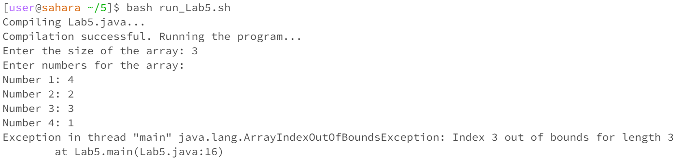

# Lab Report 5 - Putting it All Together

## Part 1 – Debugging Scenario

### Original Post from Student

*Subject:* **Help Needed: Array Index Out of Bounds Exception in Lab5 Program**


Hey everyone,

I've encountered an issue while working on my `Lab5` program. I'm trying to take user input for an array, but my program is taking 4 elements and it seems like there's an array index out of bounds exception. 

This is my error:


Here's the relevant code:

```java
for (int i = 0; i <= size; i++) {
    System.out.print("Number " + (i + 1) + ": ");
    numbers[i] = scanner.nextInt();
}
``````

### TA Response

*Subject:* **Re: Help Needed: Array Index Out of Bounds Exception - Suggestion**

Hey there,

Thanks for providing the code snippet. It looks like the loop condition might be causing the issue. Consider taking a closer look at the loop condition, especially regarding how it iterates over the array indices. Try to ensure that you stay within the bounds of the array. Let me know if this helps or if you have any questions about the loop condition!

Original buggy java code
```
import java.util.Scanner;

public class Lab5 {
    public static void main(String[] args) {
        Scanner scanner = new Scanner(System.in);

        System.out.print("Enter the size of the array: ");
        int size = scanner.nextInt();

        int[] numbers = new int[size];

        System.out.println("Enter numbers for the array:");

        for (int i = 0; i <= size; i++) {
            System.out.print("Number " + (i + 1) + ": ");
            numbers[i] = scanner.nextInt();
        }

        System.out.println("Numbers in the array:");
        for (int i = 0; i < size; i++) {
            System.out.println(numbers[i]);
        }

        System.out.println("Program executed successfully!");
    }
}
```
